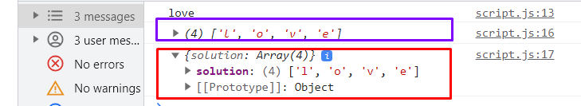

# Hangman Game Intro

- **Hangman is a word-guessing game** where one player thinks of a word and the other player(s) attempt to guess it by suggesting letters one at a time. The game is played by following these general steps:

1. One player (the "word setter") thinks of a word.
2. The word setter indicates the number of letters in the word using dashes or underscores, representing each letter's position.
3. Another player (the "guesser") starts guessing letters of the word.
4. If the guessed letter is present in the word, the word setter reveals all occurrences of that letter in the correct positions.
5. If the guessed letter is not in the word, the guesser receives a strike or a body part of a hanging stick figure (drawn progressively for each incorrect guess).
6. The guesser continues guessing letters until they either correctly guess the entire word or accumulate a certain number of strikes or wrong guesses (which typically result in losing the game).
7. If the guesser successfully guesses the word before reaching the maximum number of strikes, they win. Otherwise, the word setter wins.
8. The game can be played using various word categories, such as animals, countries, movies, or any other subject that can be represented by words. The objective is for the guesser to identify the hidden word by guessing the letters correctly within a limited number of attempts.

- Hangman is often played on paper or a whiteboard, but it can also be implemented as a computer or mobile game.

# Random Sort Array

```
btn.addEventListener("click", function () {
  myWords.sort();
  console.log(myWords);
});

```

- OUTPUT : ['for', 'is', 'javascript', 'love', 'my', 'unbeatable']

- Now sorting the array randomly, passing one more anonymous function inside sort(), `.5` represents -5

```
btn.addEventListener("click", function () {
  myWords.sort(function () {
    return 0.5 - Math.random();
  });
  console.log(myWords);
});
```

- OUTPUT
- ['for', 'my', 'unbeatable', 'javascript', 'is', 'love']
- script.js:12 (6) ['for', 'is', 'my', 'love', 'javascript', 'unbeatable']
- script.js:12 (6) ['javascript', 'love', 'for', 'is', 'my', 'unbeatable']
- script.js:12 (6) ['javascript', 'love', 'for', 'is', 'my', 'unbeatable']
- script.js:12 (6) ['my', 'is', 'for', 'love', 'javascript', 'unbeatable']

## get the first element of array we used shift()

```
btn.addEventListener("click", function () {
 myWords.sort(function () {
   return 0.5 - Math.random();
 });
 let theWord = myWords.shift();
 console.log(theWord);
});
```

- OUTPUT:

- (4) ['javascript', 'love', 'my', 'unbeatable']
- script.js:14 for

# Build the Game Area

```
  player.solution = theWord.split("");
  console.log(player.solution);
  console.log(player);


```

- OUTPUT:
  

## creating `buildBoard` function

```
btn.addEventListener("click", function () {
  myWords.sort(function () {
    return 0.5 - Math.random();
  });
  let theWord = myWords.shift();
  console.log(theWord);

  player.solution = theWord.split("");
  console.log(player.solution);
  console.log(player);

  buildBoard();
});

function buildBoard() {
  player.solution.forEach(function (letter) {
    console.log(letter);
  });
}

```

- ;

## Creating underscores = number of letters inside forEach

```

 let div_for_each_underscore = document.createElement("div");
    div_for_each_underscore.classList.add("letter2");

    div_for_each_underscore.innerText = "_";
    div_for_each_underscore.myLetter = letter;

    output2.appendChild(div_for_each_underscore)

```

- 

- use of `div_for_each_underscore.myLetter`, mattching each underscore with each letter, if we `console.log( div_for_each_underscore.myLetter)`
- OUTPUT:

```
l
l
o
o
v
v
e
e
```

# Add Alphabet letters inside buildBoard function

```
for (let x = 0; x < 26; x++) {
    let temp = String.fromCharCode(65 + x);
    console.log(temp);
  }


```

- this will generate alphabets from A to Z;

## Now adding those 26 alphabet letters to UI

```
  //Alphabets 26 letters
  for (let x = 0; x < 26; x++) {
    let temp = String.fromCharCode(65 + x);
    //temp stores single alphabet
    let div_for_each_letter_in_26 = document.createElement("div");
    div_for_each_letter_in_26.classList.add("letter");

    div_for_each_letter_in_26.myLetter = temp;
    div_for_each_letter_in_26.innerHTML = temp;

    output1.appendChild(div_for_each_letter_in_26);
  }

```

## Hide the button for now;

# Add Event Handler
