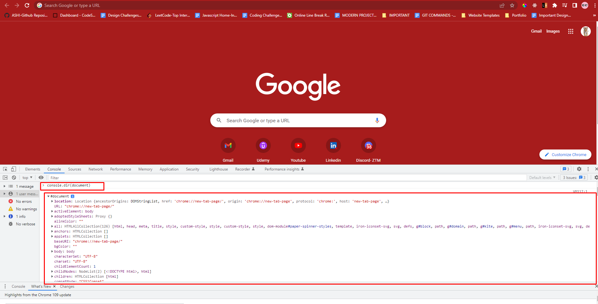

# Important Concepts

1. HTML Tree Generator : [https://chrome.google.com/webstore/detail/html-tree-generator/dlbbmhhaadfnbbdnjalilhdakfmiffeg](https://chrome.google.com/webstore/detail/html-tree-generator/dlbbmhhaadfnbbdnjalilhdakfmiffeg)

2. `console.dir(document)` will i/p the whole DOM elements

